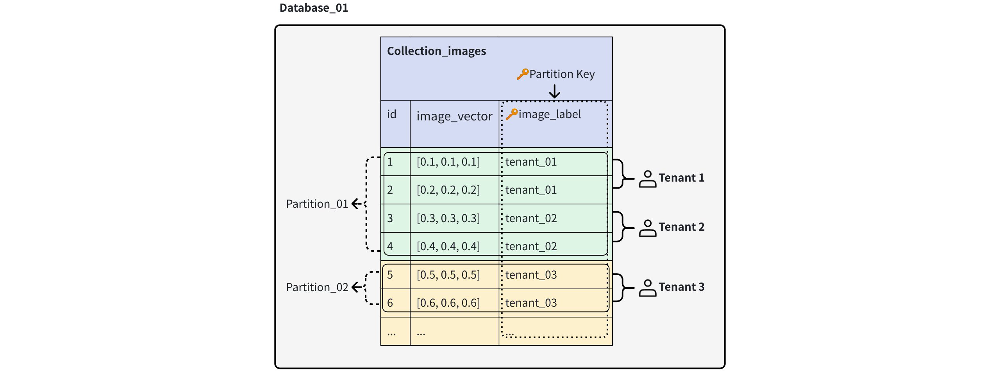

# Implement Multi-tenancy

In Zilliz Cloud, multi-tenancy means multiple customers or teams—referred to as **tenants**— share the same cluster while maintaining isolated data environments. 

Zilliz Cloud supports four multi-tenancy strategies, each offering a different trade-off between scalability, data isolation, and flexibility. This guide walks you through each option, helping you choose the most suitable strategy for your use case.

## Multi-tenancy strategies in Zilliz Cloud

Zilliz Cloud supports multi-tenancy at four levels: **Database**, **Collection**, **Partition**, and **Partition Key**. 

### Database-level multi-tenancy

With database-level multi-tenancy, each tenant receives a corresponding [database](manage_databases.md) containing one or more collections. 

- **Scalability**: The database-level multi-tenancy strategy is only available on Zilliz Cloud’s Dedicated cluster plans and supports a maximum of 64 tenants by default.

- **Data isolation**: The data in each database is fully separated, offering enterprise-grade data isolation ideal for regulated environments or customers with strict compliance needs.

- **Flexibility**: Each database can have collections with different schemas, offering highly flexible data organization and allowing each tenant to have its own data schema.

- **Others**: This strategy also supports RBAC, enabling fine-grained control over user access per tenant. Additionally, you can flexibly load or release data for specific tenants to manage hot and cold data effectively.

### Collection-level multi-tenancy

With collection-level multi-tenancy, each tenant is assigned a [collection](manage-collections.md), offering strong data isolation. 

- **Scalability**: Since a cluster can hold up to 65,536 collections by default, this strategy can accommodate the same number of tenants within the cluster.

- **Data isolation**: Collections are physically isolated from one another. This strategy provides strong data isolation.

- **Flexibility**: This strategy allows each collection to have its own schema, accommodating tenants with different data schemas.

- **Others**: This strategy also supports RBAC, allowing for granular access control over tenants. Additionally, you can flexibly load or release data for specific tenants to manage hot and cold data effectively.

### Partition-level multi-tenancy

In partition-level multi-tenancy, each tenant is assigned to a manually created [partition](manage-partitions.md) within a shared collection. 

- **Scalability**: A collection can hold up to 1,024 partitions per collection, allowing for the same number of tenants within it.

- **Data isolation**: The data of each tenant is physically separated by partitions.

- **Flexibility**: This strategy requires all tenants to share the same data schema. And partitions need to be manually created.

- **Others**: RBAC is not supported on the partition level. Tenants can be queried either individually or across multiple partitions, which makes this approach well-suited for scenarios involving aggregated queries or analytics across tenant segments. Additionally, you can flexibly load or release data for specific tenants to manage hot and cold data effectively.

### Partition key-level multi-tenancy

With this strategy, all tenants share a single collection and schema, but each tenant's data is automatically routed into 16 physically isolated partitions based on the [partition key](use-partition-key.md) value. Although each physical partition can contain multiple tenants, the data from different tenants remains logically separated. 

- **Scalability**: The partition key-level strategy offers the most scalable approach, supporting millions of tenants.

- **Data isolation**: This strategy offers relatively weak data isolation because multiple tenants can share a physical partition.

- **Flexibility**: Since all tenants must share the same data schema, this strategy offers limited data flexibility.

- **Others**: RBAC is not supported on the partition-key level. Tenants can be queried either individually or across multiple partitions, which makes this approach well-suited for scenarios involving aggregated queries or analytics across tenant segments.

## Choosing the right multi-tenancy strategy

The table below offers a comprehensive comparison between the four levels of multi-tenancy strategies.

<table>
   <tr>
     <th></th>
     <th>
<strong>Database-level</strong>
</th>
     <th>
<strong>Collection-level</strong>
</th>
     <th>
<strong>Partition-level</strong>
</th>
     <th>
<strong>Partition key-level</strong>
</th>
   </tr>
   <tr>
     <td>
<strong>Plan availability</strong>
</td>
     <td>
Dedicated plans only
</td>
     <td>
All plans
</td>
     <td>
All plans
</td>
     <td>
All plans
</td>
   </tr>
   <tr>
     <td>
<strong>Data Isolation</strong>
</td>
     <td>
Physical
</td>
     <td>
Physical
</td>
     <td>
Physical
</td>
     <td>
Physical + Logical
</td>
   </tr>
   <tr>
     <td>
<strong>Max. number of tenants</strong>
</td>
     <td>
</include target="milvus">By default, 64. You can increase it by modifying the <code>maxDatabaseNum</code> parameter in the Milvus.yaml configuration file. </include>
</td>
     <td>
</include target="milvus">By default, 65,536. You can increase it by modifying the <code>maxCollectionNum</code> parameter in the Milvus.yaml configuration file. </include>
</td>
     <td>
</include target="milvus">Up to 1,024 per collection. </include>
</td>
     <td>
Millions
</td>
   </tr>
   <tr>
     <td>
<strong>Data schema flexibility</strong>
</td>
     <td>
High
</td>
     <td>
Medium
</td>
     <td>
Low
</td>
     <td>
Low
</td>
   </tr>
   <tr>
     <td>
<strong>RBAC support</strong>
</td>
     <td>
Yes
</td>
     <td>
Yes
</td>
     <td>
No
</td>
     <td>
No
</td>
   </tr>
   <tr>
     <td>
<strong>Search performance</strong>
</td>
     <td>
Strong
</td>
     <td>
Strong
</td>
     <td>
Medium
</td>
     <td>
Medium
</td>
   </tr>
   <tr>
     <td>
<strong>Cross-tenant search support</strong>
</td>
     <td>
No
</td>
     <td>
No
</td>
     <td>
Yes
</td>
     <td>
Yes
</td>
   </tr>
   <tr>
     <td>
<strong>Support for effective handling of hot and cold data</strong>
</td>
     <td>
Yes
</td>
     <td>
Yes
</td>
     <td>
Yes
</td>
     <td>
No Currently, not supported for the partition key-level strategy. But if you have massive tenants and require effective handling of hot and cold data, please <a href="https://zilliz.com/contact-sales">contact us</a>.
</td>
   </tr>
</table>

There are several factors to consider when you choose the multi-tenancy strategy in Zilliz Cloud.

1. **Scalability:** Partition Key > Partition > Collection > Database

    If you expect to support a very large number of tenants (millions or more), use the partition key-level strategy.

1. **Strong data isolation requirements**: Database = Collection > Partition > Partition Key

    Choose database, collection, or partition-level strategies if you have strict physical data isolation requirements. 

1. **Flexible data schema for each tenant's data:** Database > Collection > Partition = Partition Key

    Database-level and collection-level strategies provide full flexibility in data schemas. If your tenants' data structures are different, choose database-level or collection-level multi-tenancy.

1. **Others**

    1. **Performance:** Search performance is determined by various factors including indexes, search parameters, and machine configurations. Zilliz Cloud also support performance-tuning. It is recommended to test the actual performance before you select a multi-tenancy strategy.

    1. **Effective handling of hot and cold data**: Currently, the database-level, collection-level, and partition-level strategy all support hot and cold data handling. For those who want to choose the partition key-level strategy but require hot and cold data handling, please [contact us](https://zilliz.com/contact-sales).

    1. **Cross-tenant searches**: Only the partition-level and partition-key-level strategies support cross-tenant queries.

